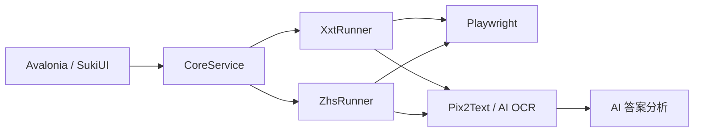

<p align="center">
  
</p>

<h1 align="center">Siua</h1>

<p align="center">
  <strong>简洁、可配置的在线课程学习辅助工具</strong>
  <br>
  使用 Avalonia、SukiUI 与 Playwright 构建
</p>

<p align="center">
  <a href="https://github.com/zxiyx/Siua/stargazers"></a>
  <a href="https://github.com/zxiyx/Siua/commits/master"></a>
  <a href="./LICENSE"></a>
  
  
</p>

<p align="center">
  <a href="#功能特性">功能特性</a> ·
  <a href="#平台支持">平台支持</a> ·
  <a href="#快速开始">快速开始</a> ·
  <a href="#配置说明">配置说明</a> ·
  <a href="#本地开发">本地开发</a>
</p>

---

Siua 是一款面向 Windows 的桌面端课程自动化工具。它将课程管理、视频策略、章节任务、OCR 与 AI 答题集中在统一的 SukiUI 界面中，并通过独立 Runner 分别处理学习通和智慧树平台。

> [!WARNING]
> 本项目仅供技术研究与学习交流。使用前请遵守课程要求、平台条款与相关法律法规，并自行承担账号和操作风险。平台页面更新、网络状态以及 AI 输出都可能影响执行结果。

## 功能特性

<table>
  <tr>
    <td width="50%" valign="top">
      <h3>🎓 多平台课程</h3>
      <p>学习通与智慧树采用独立执行流程；每个平台可保存多个课程地址，并在启动时选择指定课程。</p>
    </td>
    <td width="50%" valign="top">
      <h3>▶️ 视频策略</h3>
      <p>支持自动遍历、跳过已完成内容、静音、倍速播放，以及尝试快速完成视频。</p>
    </td>
  </tr>
  <tr>
    <td width="50%" valign="top">
      <h3>🤖 OCR 与 AI 答题</h3>
      <p>可使用本地 Pix2Text 或 AI 识别题目截图，再通过已配置的模型分析答案并匹配选项。</p>
    </td>
    <td width="50%" valign="top">
      <h3>🧩 可配置工作流</h3>
      <p>弹窗等待、章节间隔、答题请求间隔、浏览器和自动答题策略均可在界面中调整。</p>
    </td>
  </tr>
</table>

此外，Siua 还提供：

- 学习通视频、文档和章节测试任务处理
- 智慧树目录展开、SVG 视频进度判断和独立测试页面处理
- Pix2Text 运行环境安装、服务启动、停止及监听地址配置
- DeepSeek、阿里 Qwen、Kimi、腾讯混元、豆包和自定义 OpenAI 兼容接口
- 设置自动保存和按来源分类的运行日志
- 可恢复错误的日志记录，减少非关键异常中断整个课程流程

## 平台支持

| 平台 | 视频 | 文档 | 章节测试 | 状态 |
| :--- | :---: | :---: | :---: | :---: |
| 学习通 | ✅ | ✅ | ✅ | 已适配 |
| 智慧树 | ✅ | — | ✅ | 已适配 |
| 中国大学 MOOC | — | — | — | 计划中 |
| U 校园 | — | — | — | 计划中 |

> 平台 DOM 结构可能随时调整。遇到失效时，请保留脱敏后的日志、页面结构或截图并提交 Issue。

## 快速开始

### 环境要求

- Windows 10 / 11
- [.NET 10 SDK](https://dotnet.microsoft.com/download/dotnet/10.0)
- Microsoft Edge，或系统中可用的 Chromium 内核浏览器
- 可正常访问课程平台的网络环境
- 可选：AI 服务 API Key，用于章节测试分析或 AI 图像识别
- 可选：[uv](https://docs.astral.sh/uv/)，用于从应用内安装 Pix2Text

### 获取并运行

```powershell
git clone https://github.com/zxiyx/Siua.git
cd Siua
dotnet restore
dotnet run --project .\Siua\Siua.csproj
```

### 首次使用

1. 打开“设置”，选择学习平台并添加课程地址。
2. 返回“开始”页，从当前平台的课程列表中选择本次课程。
3. 根据需要设置视频策略、流程间隔和弹窗等待时间。
4. 需要自动答题时，配置 AI 模型并选择 Pix2Text 或 AI 图像识别。
5. 使用 Pix2Text 时，依次点击“安装”和“启动”。
6. 点击“执行课程”，在浏览器中完成登录后再点击“启动学习”。

支持的课程地址域名：

| 平台 | 地址 |
| :--- | :--- |
| 学习通 | `chaoxing.com`、`xuexitong.com` |
| 智慧树 | `zhihuishu.com`、`zhidao.com` |

## 配置说明

### 视频与流程

| 设置项 | 说明 |
| :--- | :--- |
| 跳过已完成 | 忽略已经完成的课程任务 |
| 尝试完成视频 | 尝试直接推进视频，失败后继续正常播放 |
| 静音播放 | 控制视频静音状态 |
| 视频倍速 | 设置课程视频播放速率 |
| 弹窗等待 | 等待平台确认框等弹窗出现的时间 |
| 章节间隔 | 完成当前内容后进入下一章节前的等待时间 |
| 答题请求间隔 | 控制连续 AI 请求之间的等待时间 |

### Pix2Text

Pix2Text 用于识别题目截图中的普通文字与数学公式，默认服务地址为：

```text
http://127.0.0.1:8503/
```

| 操作 | 说明 |
| :--- | :--- |
| 安装 | 在软件目录创建 `Pix2TextRuntime` 独立运行环境 |
| 启动 | 启动本地 HTTP 识别服务并等待模型加载 |
| 停止 | 结束服务并尝试释放配置的监听端口 |

安装时会优先复用系统中可用的 Python；未检测到 Python 时，才会通过 uv 准备 Python 3.11。首次安装和首次加载模型通常需要较长时间。

### AI 模型

在“设置 → AI 模型设置”中选择服务商并填写 API Key 与模型名称。选择“自定义”时，可以使用 OpenAI 兼容接口地址。

> [!TIP]
> API Key 仅保存在本机设置文件中。分享日志、截图或配置文件前，请先移除账号信息、课程信息和密钥。

## 工作原理



- `CoreService` 负责浏览器生命周期、登录状态和平台调度。
- `XxtRunner` 与 `ZhsRunner` 分别组织不同平台的课程流程。
- Playwright 负责页面定位、交互、等待和截图。
- Pix2Text 或 AI OCR 负责题目识别，AI 服务负责答案分析。

## 技术栈

| 组件 | 用途 |
| :--- | :--- |
| .NET 10 / C# | 应用运行时与主要开发语言 |
| Avalonia 12 | 跨平台桌面 UI 框架 |
| SukiUI 7 | 应用主题与控件风格 |
| CommunityToolkit.Mvvm | MVVM、命令与属性通知 |
| Microsoft Playwright | 浏览器自动化 |
| OpenAI-DotNet | AI 服务调用 |
| Pix2Text | 本地文字与数学公式识别 |

## 项目结构

```text
Siua/
├─ Siua/
│  ├─ Core/
│  │  ├─ xxt/          # 学习通页面解析与 XxtRunner
│  │  └─ zhs/          # 智慧树页面解析与 ZhsRunner
│  ├─ Services/        # 浏览器、AI、Pix2Text、日志与设置
│  ├─ ViewModels/      # MVVM 视图模型
│  ├─ Views/           # Avalonia / SukiUI 界面
│  └─ Assets/          # 图标与应用资源
├─ Test/               # 平台页面和 Pix2Text 实验项目
├─ Siua.sln
└─ README.md
```

## 本地开发

构建主项目：

```powershell
dotnet build .\Siua\Siua.csproj
```

发布 Windows 版本：

```powershell
dotnet publish .\Siua\Siua.csproj -c Release
```

## 参与贡献

欢迎提交 Issue 或 Pull Request。反馈平台适配问题时，建议提供：

- 平台名称与课程页面类型
- 可复现的操作步骤
- 已脱敏的 Siua 日志
- 相关页面结构变化或截图

## 许可证

本项目基于 [MIT License](./LICENSE) 开源。

<p align="center">
  Made with 🧡 by <a href="https://github.com/zxiyx">zxiyx</a>
</p>
